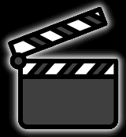

<link href="./css/styles.css" rel="stylesheet" />

# How should I record myself?

We'll walk you through how we do it.

## Step 1: Tooling

You'll need hardware:

- [audio interface](https://www.behringer.com/product.html?modelCode=0805-AAL): to plug in your microphone or instrument cable
- microphone:

Choose your recording method.

- We use [OBS studio](https://obsproject.com/) to record audio and video simultaneously. It packages the recording into a single video for simplicity.

- It's simple to record audio and video separately, too. Hit record on the camera, then on the audio recorder, and then:

## Step 2: Sync Audio + Video

You'll need to create a sharp audio wave spike paired cause by something like a hand clap in the video.

How do I do this?

Once both audio and video are recording, use a following method immediately before you begin performing.

- Microphone: Face the camera and into the microphone, clap your hands 3 times.
- Drums (microphone): Just play. The audio waves spike just like hand claps.
- Instrument cable (guitar): Turn guitar so the headstock is pointing to the camera looking down the length of the neck and your pickup hand is visible on the strings. Slap the strings 3 times.
- Keyboard: With a single singer, tap a single key 3 times.
